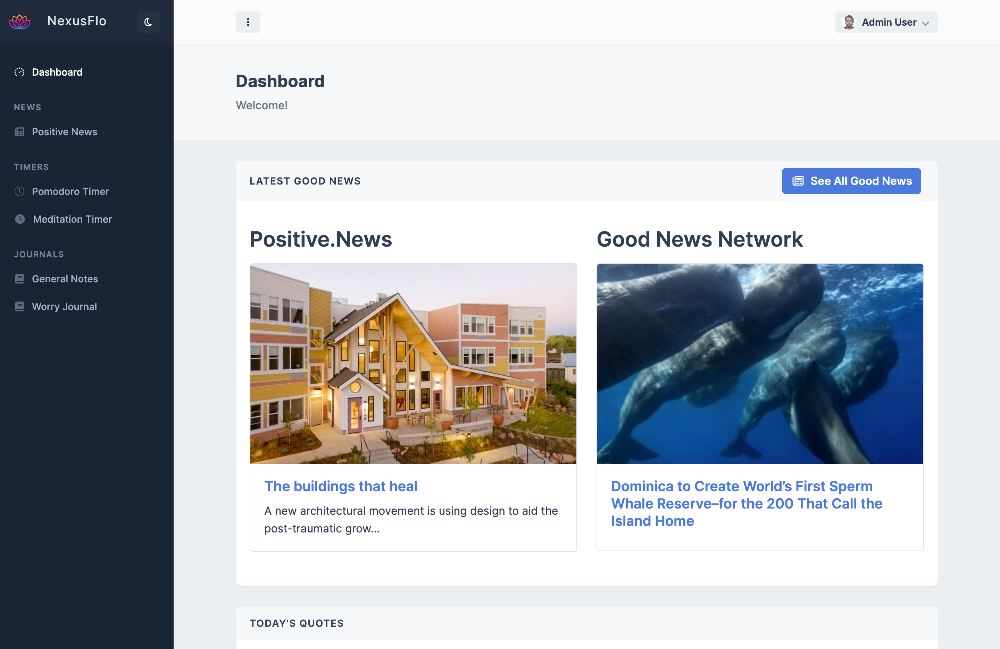

<div align="center">
    
</div>

<div align="center">
<h1>NEXUSFLO</h1>
</div>

<h4 align="center">
  <a href="https://nexusflo.uk">Live Demo</a> |
  <a href="#features">Features</a> |
  <a href="#quick-start">Quick Start</a> |
  <a href="#documentation">Documentation</a>
</h4>

<div align="center">
  <h2>
    A mental wellness companion built with Vue 3 and Laravel 9. </br>
    Empowering users to manage anxiety and depression through thoughtful features. </br>
  <br />
  </h2>
</div>

<br />
<p align="center">
  <a href="https://github.com/dandyson/nexusflo/blob/master/LICENSE">
    
  </a>
  <a href="https://github.com/dandyson/nexusflo/actions">
    
  </a>
  <a href="https://github.com/dandyson/nexusflo/pulls">
    
  </a>
  <a href="https://github.com/dandyson/nexusflo/issues">
    
  </a>
</p>

<div align="center">
  <figure>
    
    <figcaption>
      <p align="center">
        A beautiful, intuitive interface designed to support mental wellness.
      </p>
    </figcaption>
  </figure>
</div>

## Features

NexusFlo provides a comprehensive suite of features to support mental wellness:

- 🧠 **AI-Powered Worry Balancer**: Intelligent analysis of worries with balanced perspectives and actionable insights.
- 📰 **Positive News Section**: Curated uplifting content to counterbalance negative news cycles.
- ⏱️ **Productivity Tools**: 
  - Pomodoro Timer for focused work sessions
  - Meditation Timer for mindfulness breaks
- 📝 **Journaling Features**:
  - General Notes for daily thoughts
  - Worry Journal with pattern detection
- 🔒 **Security & Privacy**:
  - End-to-end encryption
  - Secure authentication
  - Data protection

- 🚀 **Technical Excellence**:
  - 80%+ test coverage
  - Full CI/CD pipeline
  - Vue 3 + Laravel 9 stack
  - Docker containerization (Laravel Sail)

## Quick Start

**Note:** These instructions are for running NexusFlo locally. For production deployment, refer to our [documentation](#documentation).

### Prerequisites

- Docker and Docker Compose
- Node.js (LTS version)
- Composer

### Installation

1. Clone the repository:
```bash
git clone https://github.com/dandyson/nexusflo.git
cd nexusflo
```

2. Configure environment:
```bash
cp .env.example .env
```

3. Start the development environment:
```bash
./vendor/bin/sail up -d
```

4. Install dependencies and run migrations:
```bash
./vendor/bin/sail composer install
./vendor/bin/sail npm install
./vendor/bin/sail artisan migrate --seed
```

5. Start the development server:
```bash
./vendor/bin/sail npm run dev
```

Visit http://localhost to see your local instance running!


## Contributing

We welcome contributions! Here's how you can help:

- Found a bug? [Report it here](https://github.com/dandyson/nexusflo/issues)
- Have a feature request? [Open an issue](https://github.com/dandyson/nexusflo/issues)

## Technical Stack

- **Frontend**: Vue 3, Vue Router, Vite, OneUI Template
- **Backend**: Laravel 9, PHP 8.1
- **Database**: MySQL
- **Testing**: PHPUnit, Vue Test Utils
- **CI/CD**: GitHub Actions
- **AI**: OpenAI API
- **Containerization**: Docker, Laravel Sail

## Acknowledgments

NexusFlo's beautiful interface is built upon the [OneUI](https://1.envato.market/AVD6j) template, a premium admin template that provides a solid foundation for the application's UI components and design system.

## License

NexusFlo is open-source software licensed under the [MIT license](LICENSE).
